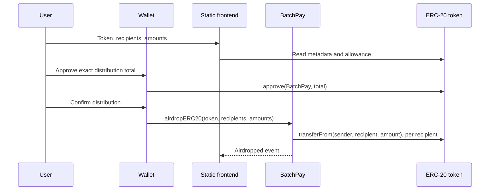

# 01 — Architecture

## Problem and design goal

BatchPay lets a token holder distribute one ERC-20 token to many recipients in a single transaction. Its primary invariant is non-custody: the BatchPay contract must never retain a user's token balance between transactions. Correctness and clarity at signing take priority over feature breadth.

## System shape

The wallet holds private keys and signs; it is the only component that handles key material. The frontend collects input, reads chain state, calculates a preview, and describes transaction progress. It is not a security boundary. BatchPay validates the request and relays token transfers. The external ERC-20 contract owns balances and allowances.

## Trust boundaries

| Boundary | Rule |
| --- | --- |
| Frontend to contract | Treat all frontend validation as convenience only; revalidate on chain. |
| User to wallet | Show a precise preview before the wallet prompt; the wallet remains the signing authority. |
| BatchPay to token | Assume token code can be unusual or hostile; support only the stated compatibility policy. |
| Allowance grant | Request the exact calculated total by default, never an unlimited approval. |

ERC-20 allowances make approval and distribution separate transactions. This is a token-standard constraint, not an accidental UX choice. The product must label the two signatures distinctly: first permission, then payment.

## Deliberate boundaries

There is no BatchPay backend, database, custody service, cross-chain messaging, privileged administrator, upgrade proxy, native-asset transfer, NFT transfer, or claim-based distribution in v1. Deployments are chain-specific and the frontend must map the connected chain to the correct contract address. These constraints make the trust model small enough to explain and audit.

The public interface and validation rules are specified in Chapter 09; the source-level realization follows in Chapter 10.

## Why a relay contract is the right primitive

There are two broad ways to implement a batch payment. A custodial distributor first receives the full amount, records an internal balance, and later sends separate payments. That model introduces a new question: who can withdraw funds if the final step fails, the owner disappears, or a configuration mistake occurs? It also requires storage and an administrative recovery policy.

BatchPay chooses the other model. During the single distribution transaction, it asks the token contract to move each amount from the caller directly to the recipient. The contract is a relay for authorization already expressed through ERC-20 allowance; it is not a vault. As a consequence, an on-chain balance held by BatchPay is not part of the normal flow, and there is no withdrawal feature to secure.

This does not mean BatchPay is trusted with no power. A user who approves it permits it to call `transferFrom` up to that allowance. The product must therefore show the contract address, requested allowance, token identity, recipient count, and total before the approval signature. Exact approvals limit the impact of a mistaken or compromised frontend, although they do not replace source verification and careful wallet review.

## Transaction lifecycle and failure semantics

The user first grants an allowance and then calls the distributor. The second transaction is executed as one EVM state transition. If BatchPay has successfully asked the token to pay several recipients and a later token call fails, the EVM reverts the entire transaction. Balances, allowances, token `Transfer` logs, and BatchPay's own event return to their pre-transaction state. The user loses only the gas consumed by the failed transaction; no subset of recipients remains paid.

This atomicity is critical to the product promise. An off-chain script sending independent transfers cannot make the same promise without its own reconciliation procedure. BatchPay exchanges the flexibility of partial retry for a simpler and safer all-or-nothing operation.

## Frontend responsibilities in detail

The frontend is a transaction composer, not a source of truth. Before requesting approval it should:

1. Verify that the wallet is connected to a supported EVM chain.
2. Read the token's metadata and present both the supplied address and recognizable name/symbol, while warning that metadata is not proof of legitimacy.
3. Validate each recipient as a checksum-capable address and convert human amounts to integer token base units without floating-point arithmetic.
4. Calculate the aggregate amount, inspect current allowance and balance, estimate gas for the exact recipient list, and show an explicit review screen.
5. Request an approval for the exact aggregate amount when necessary, wait for confirmation, then send the distribution transaction.

After submission, it should track the transaction hash and distinguish a wallet rejection, RPC/network error, on-chain revert, and confirmation. These are different user actions: a rejected signature needs no recovery; an allowance revert may require a new approval; an out-of-gas estimate may require a smaller batch. None of these UI decisions belongs in the contract.

## Architectural consequences

The contract must be deployed separately on every supported chain because an EVM deployment address and storage live on one chain. The same source can be deployed deterministically or conventionally, but the frontend must never assume that an address on one chain refers to the same code on another. Maintain an explicit chain-ID-to-address configuration and expose it publicly.

Similarly, blockchain history is the durable record. A future indexer may make payment history easier to search, but it must derive information from the token `Transfer` logs and the `Airdropped` event rather than become a system of record. This keeps the product usable even if an optional hosted service is unavailable.
